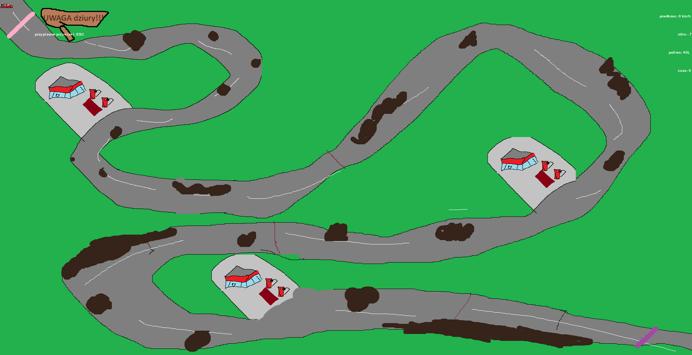
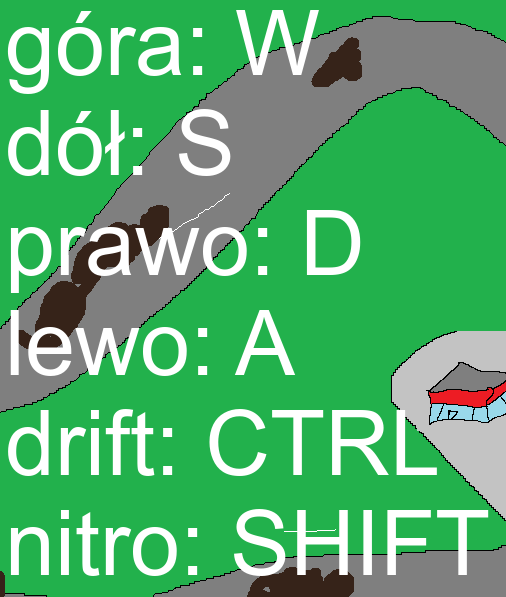
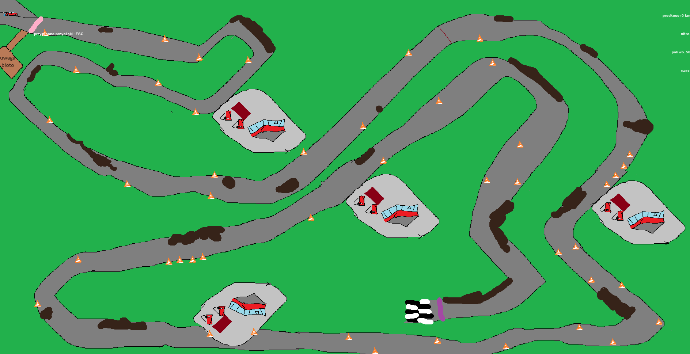

# 🚗 Need for Speed: Wiocha Edition

Pikselowa gra zręcznościowa, w której prowadzisz wiejski samochód po torze pełnym przeszkód! Unikaj bali słomy, drzew, krów i dziur w drodze, aby dojechać jak najdalej bez kraksy.

## 🎮 Opis gry

"Need for Speed: Wiocha Edition" to retro-stylowa gra 2D 
stworzona w Pythonie. Gracz kieruje samochodem jadącym po 
torze i musi omijać przeszkody 
i dojechać do mety

## 🧩 Mechanika gry

- Losowo rozmieszczone przeszkody
- Gra kończy się po wyjechaniu z toru
- Nitro zdobywa sie podczs driftu
- po najechaniu na czerwone pole obok dustrybutora 
- paliwa zdobywa sie pełny bak 

## 🖼️ Zrzuty ekranu

   
## 🚀 Jak uruchomić

1. Zainstaluj Pythona 3.10 lub nowszego
2. Zainstaluj zależności:

```bash
pip install -r requirements.txt